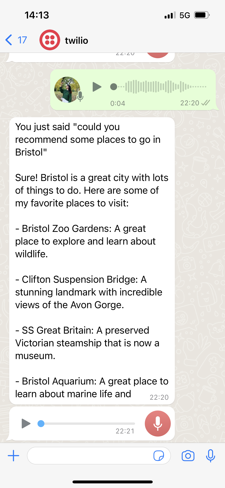
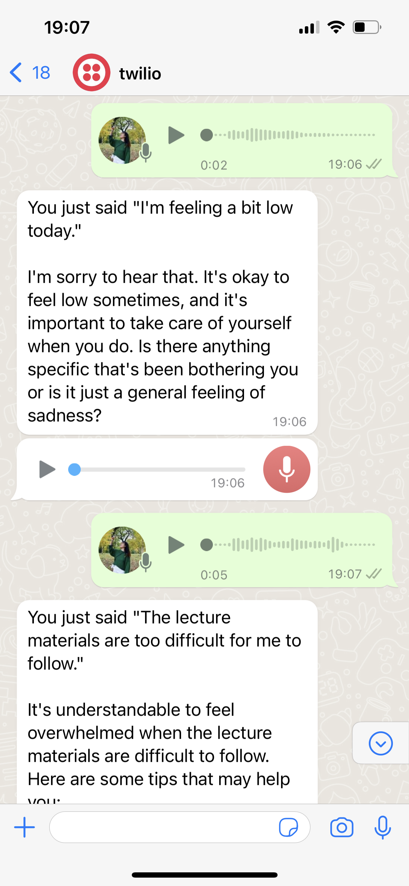

# EMA-with-chatGPT

### An EMA(Ecological momentary assessment) chat app embedded in Whats'App through Twilio to check in on University students's mental feelings.

The app is also integrated with text-to-speech and speech-to-text conversion which allows the users to reply how they feel using voice messages. The app is linked with newly released chatgpt 3.5 model to run sentiment analysis on the user's reply, answer all the questions they raise and provide mental supports and care.

